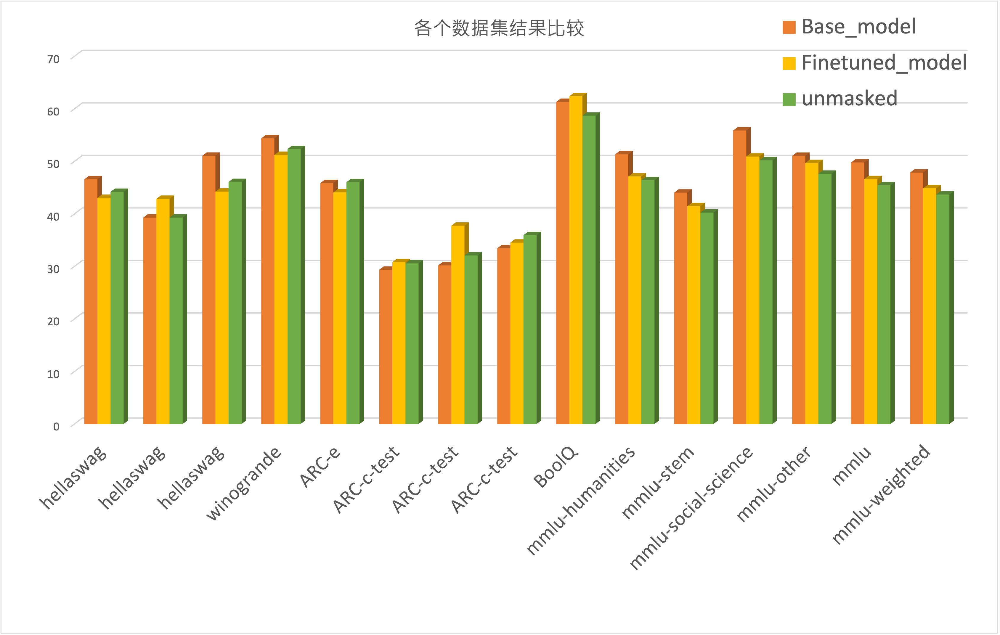
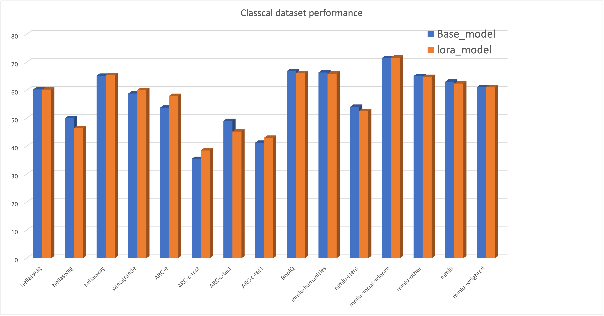

# Supervised Finetune Training

This is the Introduction of our repository, for the project-1 of natural language process (CS3602).

## Result

### Pure sft full finetune

### Lora fine tune 1.5B

## To developers

For those who maintaining the project, please be aware that you should work under the directories that you are **respond to**.

## File Structure

**The project now is under constructions so the structure will be released soon.**

## report

**Release soon.**

## Finetuned model link

We will provide links for our **output-loss only finetuned** model and **whole sequence model** by the following links(named **masked** and **unmasked**):

[download links by Baidu NetDisk, password 1234](https://pan.baidu.com/s/1o4LLaOw-bQMsreTjEfXlOQ?pwd=1234)

[download links by SJTU jBox, students and staff only, no dataset and base model](https://jbox.sjtu.edu.cn/l/q1hwDo)

## Important notifications

1. The finetune-evaluation code is `finetune_masked.ipynb` and `finetuned_unmasked.ipynb`, for the previous one is for output loss only finetune and the second one is for whole sequence loss calculation.
2. Logs during training process was in `tensorboard_events`.
3. The final evaluation results was in `evaluation_results`. The final statistical tables and pictures was in `assets`.
4. After you downloaded the model, you can put the model at the following structure:

**Release soon.**
